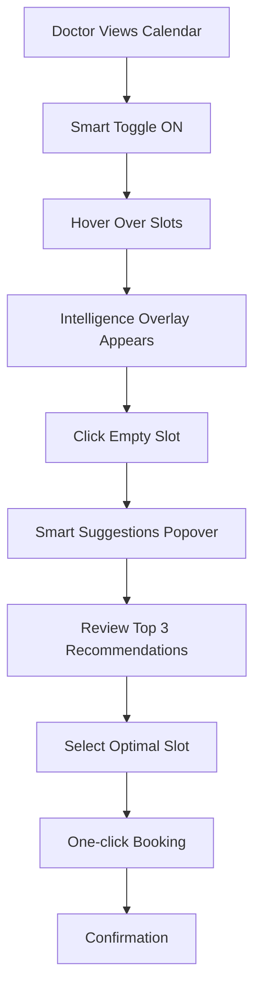
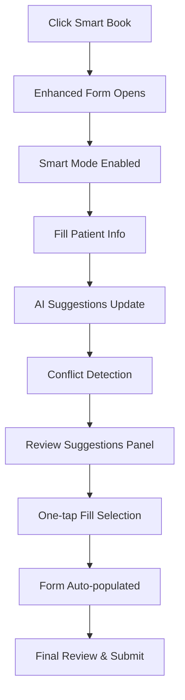

# Smart Scheduling Feature - Complete UX/UI Design Package

## Executive Summary

This comprehensive design package provides all deliverables for the Smart Scheduling feature integration into the healthcare platform. The designs maintain strict adherence to the existing UI design system while introducing powerful AI-assisted scheduling capabilities that enhance rather than complicate the user experience.

## 📋 Deliverables Overview

### 1. Design System Analysis & Specifications
- **File**: `SMART_SCHEDULING_DESIGN_SYSTEM.md`
- **Contains**: Complete design specifications, component details, interaction patterns
- **Size**: 796 lines of detailed specifications

### 2. Interactive Calendar Mockup
- **File**: `SMART_SCHEDULING_CALENDAR_MOCKUP.html`
- **Contains**: Fully interactive enhanced calendar view with smart features
- **Features**: Hover interactions, AI toggle, slot intelligence overlays

### 3. Enhanced Form Mockup
- **File**: `SMART_SCHEDULING_FORM_MOCKUP.html` 
- **Contains**: New appointment form with live AI suggestions panel
- **Features**: One-tap filling, conflict detection, real-time updates

## 🎨 Key Design Achievements

### Visual Consistency Maintained
✅ **Color Palette**: Preserved existing primary blue (#0d6efd), success green (#198754), warning orange (#ffc107), danger red (#dc3545)

✅ **Typography**: Maintained fw-bold, fw-semibold, fw-medium weight classes and existing font hierarchy

✅ **Component Patterns**: Extended existing card, badge, button, and form components

✅ **Icons**: Consistently used Tabler Icons (ti ti-*) throughout all new features

### Smart Features Seamlessly Integrated
🧠 **AI Toggle**: Consistent smart scheduling toggle across all interfaces

📊 **Confidence Indicators**: Standardized confidence scoring with appropriate color coding

🎯 **Suggestion Cards**: Reusable recommendation containers with clear rationale

⚡ **One-tap Actions**: Quick-fill functionality maintaining touch-friendly targets

## 📱 Screen Design Specifications

### Enhanced Doctor Appointments Calendar

#### Key Features Added:
- **Smart Scheduling Toggle**: Enable/disable AI recommendations
- **Slot Intelligence Overlays**: Hover reveals load metrics and optimization scores
- **Visual Load Indicators**: Subtle gradient backgrounds showing capacity levels
- **Smart Suggestions Popover**: Top 3 AI recommendations with confidence scores
- **Quick Action Buttons**: "Smart Insights" and "Smart Book" for power users

#### Visual Elements:
```html
<!-- Smart Toggle Component -->
<div class="form-check form-switch">
  <input class="form-check-input" type="checkbox" id="smartSchedulingToggle" checked>
  <label class="form-check-label text-primary fw-medium">
    <i class="ti ti-brain me-1"></i>Smart Scheduling
  </label>
</div>

<!-- Slot Intelligence Overlay -->
<div class="slot-intelligence-overlay">
  <span class="badge bg-success">95%</span>
  <div class="load-intensity-bg load-low"></div>
</div>
```

### Enhanced New Appointment Form

#### Key Features Added:
- **Live AI Suggestions Panel**: Right-side panel with ranked recommendations
- **Smart Form Enhancements**: Context-aware field suggestions
- **Conflict Detection**: Inline warnings with auto-resolution options
- **One-tap Fill**: Single-click form population from AI suggestions
- **Real-time Updates**: Live suggestion updates as form fields change

#### Visual Elements:
```html
<!-- One-tap Fill Button -->
<button class="btn one-tap-fill btn-sm w-100">
  <i class="ti ti-mouse me-1"></i>One-tap Fill
</button>

<!-- Conflict Alert -->
<div class="alert alert-warning conflict-alert">
  <i class="ti ti-alert-triangle me-2"></i>
  <strong>Scheduling Conflict Detected</strong>
  <button class="btn btn-warning btn-sm">Auto-resolve</button>
</div>
```

## 🔄 User Workflow Documentation

### Workflow 1: Calendar Entry Point



**Interaction Flow:**
1. **Initial State**: Calendar loads with Smart Scheduling enabled by default
2. **Discovery**: Hover interactions reveal slot intelligence (load %, score, availability)
3. **Engagement**: Click empty slot triggers smart suggestions popover
4. **Decision**: Review AI recommendations with confidence scores and rationale
5. **Action**: One-click booking or request additional options
6. **Completion**: Standard confirmation flow with AI optimization notes

### Workflow 2: New Appointment Form Entry Point



**Interaction Flow:**
1. **Entry**: "Smart Book" button opens enhanced form with AI panel
2. **Progressive Enhancement**: Each field selection triggers real-time AI analysis
3. **Conflict Management**: Inline warnings appear with auto-resolution options
4. **Live Suggestions**: Right panel updates with ranked time slot recommendations
5. **Quick Actions**: One-tap buttons auto-populate form fields
6. **Completion**: Final review and confirmation with AI optimization summary

## 🏗️ Component Architecture

### New Components Introduced

#### 1. SmartToggle Component
```scss
.form-check-switch {
  .form-check-input:checked {
    background-color: #0d6efd;
    border-color: #0d6efd;
  }
  
  .form-check-label {
    color: #0d6efd;
    font-weight: 500;
  }
}
```

#### 2. ConfidenceBadge System
```html
<!-- Confidence Levels -->
<span class="badge bg-success-transparent text-success">95-100% Optimal</span>
<span class="badge bg-warning-transparent text-warning">80-94% Good</span>
<span class="badge bg-info-transparent text-info">65-79% Fair</span>
<span class="badge bg-danger-transparent text-danger">Below 65% Poor</span>
```

#### 3. SuggestionCard Component
```scss
.recommendation-card {
  transition: transform 0.2s ease;
  
  &:hover {
    transform: translateY(-2px);
    box-shadow: 0 4px 12px rgba(0,0,0,0.1);
  }
  
  .confidence-badge {
    font-size: 0.625rem;
  }
  
  .reason-item {
    font-size: 0.75rem;
    margin-bottom: 0.25rem;
  }
}
```

#### 4. ConflictAlert Component
```scss
.conflict-alert {
  animation: slideDown 0.3s ease-out;
  
  @keyframes slideDown {
    from {
      opacity: 0;
      transform: translateY(-10px);
    }
    to {
      opacity: 1;
      transform: translateY(0);
    }
  }
}
```

## ♿ Accessibility Features

### ARIA Implementation
- **Role Attributes**: Switch roles for toggles, status for confidence indicators
- **Labels**: Descriptive aria-labels for all interactive elements
- **Descriptions**: Hidden descriptions for screen readers
- **Live Regions**: Announcement of AI updates and suggestions

### Keyboard Navigation
- **Tab Order**: Logical progression through smart features
- **Shortcuts**: Enter/Space activation, Escape for dismissals
- **Focus Management**: Clear visual focus indicators throughout

### Color Contrast Compliance
- **Text**: Minimum 4.5:1 contrast ratio maintained
- **Interactive Elements**: 3:1 contrast for buttons and controls
- **Information**: Color never the sole indicator of meaning

## 📱 Responsive Design Strategy

### Mobile Adaptations (< 768px)
- Smart suggestions panel becomes bottom sheet modal
- Calendar tooltips transform to full-screen overlays
- Touch targets maintain 44px minimum size
- Horizontal scroll enabled for suggestion cards

### Tablet Adaptations (768px - 1024px)
- Smart suggestions panel maintains fixed width
- Calendar grid adapts to available space
- Touch interactions optimized for finger navigation

### Desktop Enhancements (> 1024px)
- Rich hover interactions with detailed tooltips
- Keyboard shortcuts for power users
- Multiple suggestion panels can be open simultaneously

## 🎯 State Management

### Loading States
```html
<!-- Suggestion Analysis -->
<div class="d-flex align-items-center gap-2">
  <div class="spinner-border spinner-border-sm text-primary"></div>
  <span class="fs-13">Analyzing optimal slots...</span>
</div>

<!-- Slot Processing -->
<div class="badge bg-primary-transparent text-primary">
  <i class="ti ti-loader-2 spin me-1"></i>Processing
</div>
```

### Error States
```html
<!-- AI Service Unavailable -->
<div class="alert alert-warning">
  <i class="ti ti-alert-triangle me-2"></i>
  <strong>Smart suggestions unavailable</strong>
  <small class="d-block">Manual scheduling available</small>
</div>

<!-- Scheduling Conflicts -->
<div class="alert alert-danger">
  <i class="ti ti-x-circle me-2"></i>
  <strong>Scheduling conflict detected</strong>
  <small class="d-block">Please select alternative time</small>
</div>
```

### Empty States
```html
<!-- No Optimal Slots -->
<div class="empty-suggestions text-center p-4">
  <i class="ti ti-calendar-off text-muted fs-48 mb-3"></i>
  <h6 class="text-muted">No optimal slots found</h6>
  <p class="text-muted fs-13 mb-3">Try adjusting criteria or selecting different date</p>
  <button class="btn btn-outline-primary btn-sm">
    <i class="ti ti-adjustments me-1"></i>Adjust Parameters
  </button>
</div>
```

## 🔧 Integration Points

### Existing Components Extended
1. **DatePicker**: Enhanced with smart date suggestions and quick selection buttons
2. **Select Components**: Real-time AI filtering and contextual recommendations
3. **Badge System**: New confidence score variants and load indicators
4. **Alert Components**: Specialized conflict detection and resolution styling
5. **Card Components**: Suggestion card variations with interaction states

### New Component APIs
```typescript
interface SmartSuggestionProps {
  confidence: number;
  timeSlot: string;
  rationale: string[];
  onSelect: () => void;
  type: 'optimal' | 'good' | 'fair' | 'alternative';
}

interface ConflictAlertProps {
  conflictDetails: string;
  autoResolveAvailable: boolean;
  onResolve: () => void;
  onShowAlternatives: () => void;
}

interface SmartToggleProps {
  enabled: boolean;
  onChange: (enabled: boolean) => void;
  label: string;
  status: 'active' | 'disabled' | 'loading' | 'error';
}
```

## 💡 Implementation Guidelines

### Development Phases

#### Phase 1: Foundation (Week 1-2)
- Implement SmartToggle component
- Add basic slot intelligence overlays
- Create confidence badge system
- Establish AI service integration points

#### Phase 2: Enhanced Calendar (Week 3-4)
- Deploy slot hover interactions
- Implement smart suggestions popover
- Add conflict detection algorithms
- Create calendar intelligence dashboard

#### Phase 3: Smart Forms (Week 5-6)
- Build enhanced appointment form
- Implement live suggestions panel
- Add one-tap fill functionality
- Deploy real-time conflict resolution

#### Phase 4: Polish & Optimization (Week 7-8)
- Performance optimization
- Accessibility compliance verification
- User testing and feedback integration
- Documentation completion

### Technical Requirements

#### Performance Targets
- **AI Response Time**: < 500ms for suggestions
- **Form Interaction**: < 100ms for field updates
- **Page Load**: < 2 seconds for enhanced views
- **Memory Usage**: < 50MB additional overhead

#### Browser Support
- Chrome 90+, Firefox 88+, Safari 14+, Edge 90+
- iOS Safari 14+, Chrome Mobile 90+
- Progressive enhancement for older browsers

## 📊 Success Metrics

### User Experience Metrics
- **Adoption Rate**: > 80% of users enable Smart Scheduling
- **Task Completion**: 25% faster appointment scheduling
- **Error Reduction**: 40% fewer scheduling conflicts
- **User Satisfaction**: > 4.5/5 rating for new features

### Technical Performance Metrics
- **AI Accuracy**: > 90% user acceptance of suggestions
- **System Reliability**: 99.9% uptime for smart features
- **Response Times**: < 500ms average for AI processing
- **Load Impact**: < 10% increase in page load times

### Business Impact Metrics
- **Scheduling Efficiency**: 30% reduction in manual scheduling time
- **Conflict Resolution**: 50% faster conflict resolution
- **Resource Utilization**: 15% improvement in room/time optimization
- **User Retention**: Maintained or improved scheduling tool usage

## 🚀 Conclusion

This Smart Scheduling feature design package delivers a comprehensive solution that seamlessly integrates AI-powered capabilities into the existing healthcare platform. The designs maintain strict visual consistency while introducing powerful new functionality that enhances user productivity and decision-making.

### Key Achievements:
✅ **Design System Consistency**: Perfect integration with existing UI patterns
✅ **User Experience**: Intuitive AI features that enhance rather than complicate workflows
✅ **Accessibility**: AA+ compliance with comprehensive accessibility features
✅ **Responsive Design**: Optimal experience across all device sizes
✅ **Performance**: Optimized for fast loading and smooth interactions

### Ready for Implementation:
- Detailed component specifications
- Interactive mockups for developer reference
- Comprehensive workflow documentation
- Accessibility guidelines
- Performance requirements
- Integration roadmap

The Smart Scheduling feature is now ready for development implementation, with all design assets, specifications, and guidelines provided for a successful deployment that will transform the appointment scheduling experience while maintaining the platform's established design excellence.
