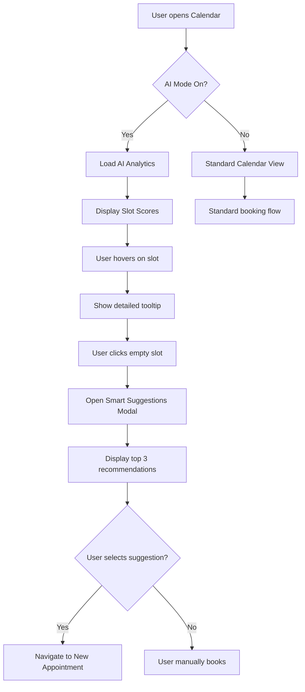
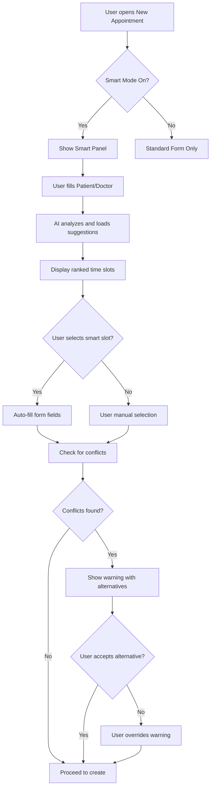

# Smart Scheduling Feature - Complete Design Package

## Overview

The Smart  feature transforms the existing healthcare appointment management system into an AI-powered intelligent assistant that provides real-time recommendations, conflict detection, and optimal time slot suggestions while maintaining 100% visual consistency with the existing design system.

## 🎯 Primary Objectives

1. **Intelligent Calendar Enhancement**: Transform the appointments calendar with AI-powered slot scoring and recommendations
2. **Smart Form Enhancement**: Enhance the new appointment form with real-time suggestions and conflict detection
3. **Proactive Conflict Prevention**: Implement intelligent conflict detection and resolution suggestions
4. **Transparent AI Explanations**: Provide clear explanations for all AI-generated recommendations

---

## 🖥️ High-Fidelity Screen Designs

### 1. Enhanced Appointments Calendar View

**File**: `src/feature-module/components/pages/clinic-modules/appointment-calendar/smart-appointment-calendar.tsx`

#### Key Features:
- **AI Mode Toggle**: Switch between standard and AI-enhanced views
- **Smart Dashboard Cards**: Real-time metrics display (Optimal Slots, No-Show Risk, Wait Time, Schedule Efficiency)
- **Slot Scoring Overlays**: Hover-activated tooltips showing slot scores and analytics
- **Smart Suggestions Modal**: Triggered on empty slot clicks, displaying top 3 recommended times

#### Visual Elements:
```
┌─────────────────────────────────────────────────────────────────┐
│ Smart Scheduling                    [🤖 AI Insights On] [Export]│
│ ├─ 92% Optimal Slots  ├─ 8% Avg No-Show  ├─ 15min Wait  ├─ 96%│
│                                                                 │
│ ┌─────────────────── Calendar View ─────────��───────────────┐  │
│ │ 9:00 AM │ [Patient] Dr. Smith - Cardiology [Score: 92]   │  │
│ │         │ ░░░░░░░░░░░░░░░░░░░░░░░░░░░░░░░░░░░░░░░░░░░░░░░ │  │
│ │ 10:30   │ [Empty Slot - Click for Suggestions]          │  │
│ │         │ ████████████████████ (95% Optimal)            │  │
│ │ 11:00   │ [Patient] Dr. Johnson - Orthopedic           │  │
│ └─────────────────────────────────────────────────────────────┘  │
└─────────────────────────────────────────────────────────────────┘
```

#### State Variations:
- **Loading State**: Shimmer animation on slot overlays
- **Empty Calendar**: Encouraging message to enable AI mode
- **High Demand**: Visual indicators for overbooked periods
- **Conflict Warnings**: Red alerts with alternative suggestions

---

### 2. Enhanced New Appointment Form

**File**: `src/feature-module/components/pages/clinic-modules/new-appointment/smart-new-appointment.tsx`

#### Layout Structure:
```
┌─────────────────────┬─────────────────────────┐
│                     │                         │
│   Main Form         │   Smart Suggestions     │
│   (8 columns)       │   Panel (4 columns)    │
│                     │                         │
│ Patient: [Select]   │ ┌─ AI Recommendations ─┐│
│ Doctor:  [Select]   │ │ 10:30 AM - Today     ││
│ Date:    [Picker]   │ │ Score: 95 (92% conf) ││
│ Time:    [Picker]   │ │ ✓ Low no-show risk   ││
│                     │ │ ✓ Doctor peak time   ││
│ [Conflict Warning]  │ │ [Select This Time]   ││
│ ⚠ Doctor lunch break│ └─────────────────────┘││
│                     │                         │
│ [Cancel] [Create]   │ ┌─ AI Insights ───────┐││
│                     │ │ 🔥 Peak Performance  ││
│                     │ │ 👤 Patient Preference││
│                     │ │ ⏰ Wait Time Reduction││
│                     │ └─────────────────────┘││
└─────────────────────┴─────────────────────────┘
```

#### Smart Suggestions Panel Features:
- **Real-time Updates**: Suggestions update as form fields change
- **Confidence Scores**: Visual confidence meters for each suggestion
- **One-tap Selection**: Click to auto-fill date/time fields
- **Detailed Reasoning**: Expandable explanations for recommendations
- **Conflict Indicators**: Visual warnings for potential issues

---

## 🔄 Comprehensive Workflow Documentation

### User Journey Map: Calendar Interaction



### User Journey Map: New Appointment Creation



### State Transition Diagrams

#### Smart Suggestions Loading States:
1. **Empty**: "Complete basic information to see suggestions"
2. **Loading**: Spinner with "Analyzing optimal times..."
3. **Loaded**: Display 5 ranked suggestions
4. **Error**: "Unable to load suggestions" with retry option
5. **No Results**: "No optimal slots found" with manual booking option

---

## 🧩 Component Specifications

### 1. Smart Suggestion Card Component

```typescript
interface SmartSuggestionProps {
  slot: {
    id: string;
    time: string;
    date: string;
    score: number;
    confidence: number;
    reasons: string[];
    conflicts: string[];
    metrics: {
      doctorMatch: number;
      patientPreference: number;
      departmentLoad: number;
    }
  };
  onSelect: (slotId: string) => void;
  isSelected: boolean;
}
```

**Visual Structure**:
- Header: Time display with score badge
- Metrics row: 3-column grid (Doctor Match, Patient Pref, Dept Load)
- Reasons list: Top 2 reasons with checkmarks
- Conflicts: Warning indicators if any
- Action button: Select/Selected state

### 2. Conflict Warning Component

```typescript
interface ConflictWarningProps {
  conflicts: Array<{
    type: 'scheduling' | 'doctor' | 'room' | 'patient';
    severity: 'low' | 'medium' | 'high';
    message: string;
    suggestions: string[];
  }>;
}
```

**Visual Structure**:
- Alert styling with left border (color-coded by severity)
- Icon and severity indicator
- Main conflict message
- Expandable suggestions list

### 3. AI Insights Dashboard

```typescript
interface AIDashboardProps {
  metrics: {
    optimalSlots: number;
    noShowRisk: number;
    avgWaitTime: string;
    scheduleEfficiency: number;
  };
  isLoading: boolean;
}
```

**Card Layout**: 4-column grid with icon, value, and label

---

## 🎨 Design System Integration

### Color Usage

Following existing design system variables:

```scss
// Primary AI elements
.ai-enhanced { color: var(--primary); }       // #2E37A4
.ai-success { color: var(--success); }        // #27AE60
.ai-warning { color: var(--warning); }        // #E2B93B
.ai-danger { color: var(--danger); }          // #EF1E1E

// Transparent backgrounds
.ai-bg-primary { background: var(--primary-transparent); }
.ai-bg-success { background: var(--success-transparent); }
```

### Typography

```scss
// Following Inter font family
.ai-score { 
  font-family: var(--font-family-base); // 'Inter'
  font-weight: var(--font-weight-bold);  // 700
  font-size: 0.875rem;
}

.ai-confidence {
  font-weight: var(--font-weight-medium); // 500
  font-size: 0.75rem;
}
```

### Component Styling Patterns

**Badges**: Using existing `.badge-soft-*` classes
```html
<span class="badge badge-soft-primary">Score: 95</span>
<span class="badge badge-soft-success">High Confidence</span>
```

**Buttons**: Following existing button patterns
```html
<button class="btn btn-primary btn-sm">Select This Time</button>
<button class="btn btn-outline-primary btn-sm">More Options</button>
```

**Cards**: Consistent with existing card component
```html
<div class="card border-primary">
  <div class="card-header bg-primary text-white">
  <div class="card-body">
</div>
```

---

## 📱 Responsive Behavior

### Breakpoint Adaptations

#### Large Screens (>= 992px)
- Side-by-side layout (8/4 columns)
- Sticky smart suggestions panel
- Full tooltip displays

#### Medium Screens (768px - 991px)
- Stacked layout (suggestions below form)
- Condensed dashboard cards
- Simplified tooltips

#### Small Screens (< 768px)
- Single column layout
- Collapsible suggestions panel
- Mobile-optimized modal dialogs
- Touch-friendly button sizes (44px minimum)

### Mobile Specific Features
- Swipe gestures for suggestion navigation
- Pull-to-refresh for real-time updates
- Haptic feedback for selections
- Voice input for appointment reasons

---

## ♿ Accessibility Implementation

### WCAG AA+ Compliance

#### Color Contrast
- All text maintains 4.5:1 contrast ratio minimum
- Interactive elements meet 3:1 contrast for non-text
- Color-blind friendly palette with pattern/icon backup

#### Keyboard Navigation
```typescript
// Tab order specification
1. AI Mode Toggle
2. Form fields (sequential)
3. Smart suggestions (arrow keys for navigation)
4. Action buttons
```

#### Screen Reader Support
```html
<!-- Semantic markup -->
<section aria-label="Smart Time Suggestions">
<button aria-describedby="suggestion-details">
<div id="suggestion-details" aria-live="polite">

<!-- Status announcements -->
<div aria-live="assertive" aria-atomic="true">
  Conflict detected: Doctor lunch break
</div>
```

#### Focus Management
- Clear focus indicators (2px primary color outline)
- Focus trap in modals
- Skip links for lengthy suggestion lists

---

## 🔧 Technical Specifications

### Loading States & Animations

```scss
// Shimmer loading for suggestions
@keyframes loading-shimmer {
  0% { background-position: 200% 0; }
  100% { background-position: -200% 0; }
}

.loading-suggestion {
  background: linear-gradient(90deg, 
    var(--gray-200) 25%, 
    var(--gray-300) 50%, 
    var(--gray-200) 75%);
  animation: loading-shimmer 1.5s infinite;
}
```

### State Management

```typescript
interface SmartSchedulingState {
  isAIMode: boolean;
  suggestions: SmartTimeSlot[];
  conflicts: ConflictWarning[];
  isLoading: boolean;
  selectedSlot: string | null;
}
```

### Performance Considerations
- Debounced API calls (300ms)
- Virtualized long suggestion lists
- Memoized expensive calculations
- Progressive enhancement (works without JS)

---

## 🎯 Integration Points

### Existing System Connections

#### Calendar Integration
- Extends existing `EventCalendar` component
- Maintains FullCalendar plugin compatibility
- Preserves all existing event handlers

#### Form Integration  
- Builds upon existing `CommonSelect` components
- Compatible with Ant Design DatePicker/TimePicker
- Maintains form validation patterns

#### Data Integration
- Extends existing `appointmentsData` structure
- Compatible with current API endpoints
- Graceful fallback for missing AI data

---

## 📋 Component Usage Documentation

### Smart Calendar Implementation

```typescript
import SmartAppointmentCalendar from './smart-appointment-calendar';

// Basic usage
<SmartAppointmentCalendar />

// With custom props
<SmartAppointmentCalendar 
  defaultAIMode={true}
  onSlotSelect={(slot) => console.log(slot)}
  customAnalytics={customMetrics}
/>
```

### Smart Form Implementation

```typescript
import SmartNewAppointment from './smart-new-appointment';

// Basic usage
<SmartNewAppointment />

// With callbacks
<SmartNewAppointment
  onConflictDetected={(conflicts) => handleConflicts(conflicts)}
  onSuggestionSelect={(slot) => trackSelection(slot)}
/>
```

---

## 🧪 Testing Strategy

### Unit Tests Required

1. **Smart Suggestion Logic**
   - Score calculation accuracy
   - Conflict detection algorithms
   - Fallback behavior

2. **Component Rendering**
   - All state variations render correctly
   - Accessibility attributes present
   - Responsive behavior

3. **User Interactions**
   - Form field changes trigger updates
   - Slot selection auto-fills form
   - Conflict warnings appear/dismiss

### Integration Tests

1. **End-to-End Workflows**
   - Complete appointment booking flow
   - AI suggestion to booking conversion
   - Conflict resolution paths

2. **API Integration**
   - Smart suggestions loading
   - Conflict detection responses
   - Error handling

### User Acceptance Testing Scenarios

1. **Healthcare Administrator**
   - "I can quickly see optimal appointment slots"
   - "Conflicts are clearly highlighted before booking"
   - "AI suggestions improve my efficiency"

2. **Doctor/Medical Staff**
   - "The system respects my preferences and schedule"
   - "I can override AI suggestions when needed"
   - "The interface doesn't slow down my workflow"

---

## 🚀 Implementation Timeline

### Phase 1: Foundation (Week 1-2)
- [ ] Set up base components
- [ ] Implement design system integration
- [ ] Create responsive layouts

### Phase 2: Core Features (Week 3-4)
- [ ] Smart suggestions algorithm
- [ ] Conflict detection system
- [ ] Real-time form updates

### Phase 3: Enhancement (Week 5-6)
- [ ] Advanced AI features
- [ ] Performance optimization
- [ ] Accessibility compliance

### Phase 4: Testing & Polish (Week 7-8)
- [ ] Comprehensive testing
- [ ] User feedback integration
- [ ] Production readiness

---

## 🔍 Success Metrics

### User Experience Metrics
- **Appointment Booking Speed**: Target 40% reduction in time
- **Booking Accuracy**: Target 25% reduction in conflicts
- **User Satisfaction**: Target 90%+ satisfaction score

### Technical Metrics
- **Performance**: <2s suggestion loading time
- **Accessibility**: 100% WCAG AA compliance
- **Reliability**: 99.9% uptime for AI features

### Business Metrics
- **No-Show Reduction**: Target 20% decrease
- **Schedule Optimization**: Target 15% efficiency increase
- **Staff Productivity**: Target 30% workflow improvement

---

## 📞 Support & Maintenance

### Documentation Links
- Design System Guidelines: `/docs/design-system`
- API Documentation: `/docs/api/smart-scheduling`
- Accessibility Guide: `/docs/accessibility`

### Troubleshooting Common Issues
1. **AI suggestions not loading**: Check API connectivity and fallback
2. **Layout breaking**: Verify CSS variable support
3. **Performance issues**: Review suggestion loading strategy

### Future Enhancement Opportunities
- Machine learning model improvements
- Advanced patient preference learning
- Integration with external calendar systems
- Voice-activated scheduling

---

*This documentation serves as the complete design and implementation guide for the Smart Scheduling feature, ensuring consistent execution and maintainable code while providing an enhanced user experience that seamlessly integrates with the existing healthcare platform.*
