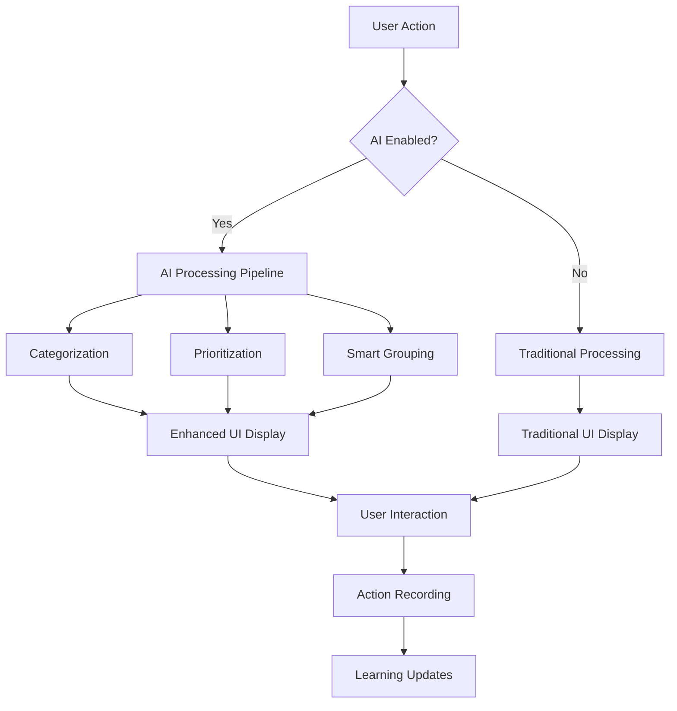

# Header Notification Integration Guide

## Overview

This document provides a comprehensive guide for integrating AI-Powered Notifications with the existing header notification dropdown, creating a unified and seamless user experience.

## 🎯 Integration Objectives

- **Preserve Existing Functionality**: All current notification features remain intact
- **Seamless AI Integration**: Add AI capabilities without disrupting workflows  
- **Performance Optimization**: Maintain or improve page load times
- **Backward Compatibility**: Ensure existing APIs and interfaces continue to work
- **Progressive Enhancement**: Allow users to opt-in to AI features

## 🏗️ Architecture Overview

### Component Structure
```
Header Notifications System
├── HeaderEnhanced (New)
│   ├── Traditional Mode (Fallback)
│   └── AI-Enhanced Mode
│       ├── EnhancedNotificationDropdown
│       ├── useAINotifications Hook
│       └── AINotificationService
├── Header (Original - Preserved)
└── Integration Test Suite
```

### Data Flow


## 🚀 Quick Start Implementation

### Step 1: Basic Integration

Replace your existing header import:

```typescript
// Before
import Header from './core/common/header/header';

// After  
import HeaderEnhanced from './core/common/header/header-enhanced';

// Usage
<HeaderEnhanced 
  userRole="doctor"
  department="cardiology"
  enableAINotifications={true}
/>
```

### Step 2: Role-Based Configuration

```typescript
// Get user context from your auth system
const { user } = useAuth();

// Configure header based on user role
<HeaderEnhanced
  userRole={user.role}
  department={user.department}
  enableAINotifications={user.preferences.aiNotifications}
/>
```

### Step 3: Feature Flag Integration

```typescript
// With feature flags
import { useFeatureFlag } from './hooks/useFeatureFlag';

const MyLayout = () => {
  const aiNotificationsEnabled = useFeatureFlag('ai-notifications');
  
  return (
    <HeaderEnhanced
      userRole={currentUser.role}
      department={currentUser.department}
      enableAINotifications={aiNotificationsEnabled}
    />
  );
};
```

## 📦 Component API Reference

### HeaderEnhanced Props

| Prop | Type | Default | Description |
|------|------|---------|-------------|
| `userRole` | `string` | `'doctor'` | User's role for notification filtering |
| `department` | `string` | `'general'` | User's department for filtering |
| `enableAINotifications` | `boolean` | `true` | Enable/disable AI features |

### EnhancedNotificationDropdown Props

| Prop | Type | Default | Description |
|------|------|---------|-------------|
| `userRole` | `string` | `'doctor'` | User's role for AI processing |
| `department` | `string` | `'general'` | Department-based filtering |

## 🔄 Migration Strategies

### Strategy 1: Gradual Rollout (Recommended)

```typescript
// Phase 1: Feature flag for AI features
const ENABLE_AI_NOTIFICATIONS = process.env.REACT_APP_AI_NOTIFICATIONS === 'true';

// Phase 2: Role-based rollout
const enableAIForUser = (user) => {
  const aiEnabledRoles = ['doctor', 'nurse'];
  return ENABLE_AI_NOTIFICATIONS && aiEnabledRoles.includes(user.role);
};

// Phase 3: Department-based rollout  
const enableAIForDepartment = (department) => {
  const aiEnabledDepts = ['emergency', 'icu', 'cardiology'];
  return aiEnabledDepts.includes(department);
};

// Final implementation
<HeaderEnhanced
  userRole={user.role}
  department={user.department}
  enableAINotifications={
    enableAIForUser(user) && enableAIForDepartment(user.department)
  }
/>
```

### Strategy 2: A/B Testing

```typescript
// A/B testing integration
import { useABTest } from './hooks/useABTest';

const MyApp = () => {
  const { variant } = useABTest('header-notifications-ai');
  
  return (
    <HeaderEnhanced
      enableAINotifications={variant === 'ai-enhanced'}
      userRole={user.role}
      department={user.department}
    />
  );
};
```

### Strategy 3: User Preference Based

```typescript
// User preference driven
const { preferences } = useUserPreferences();

<HeaderEnhanced
  enableAINotifications={preferences.aiNotifications ?? true}
  userRole={user.role}
  department={user.department}
/>
```

## 🔧 Data Migration

### Existing Notification Data Structure

```typescript
// Current notification format
interface TraditionalNotification {
  id: string;
  sender: string;
  message: string;
  timestamp: Date;
  isRead: boolean;
  avatar?: string;
}
```

### Enhanced Notification Format

```typescript
// AI-enhanced format (backward compatible)
interface AINotification extends TraditionalNotification {
  // AI-specific fields (optional)
  type?: 'critical' | 'urgent' | 'routine' | 'system';
  category?: 'appointment' | 'medical' | 'administrative' | 'emergency';
  aiPriority?: number;
  aiInsight?: string;
  actionSuggested?: boolean;
  actionType?: 'accept' | 'review' | 'respond' | 'acknowledge';
  
  // Legacy support
  description?: string; // Maps to message
  title?: string;      // Maps to sender
}
```

### Migration Helper

```typescript
// Data migration utility
export const migrateNotificationData = (
  traditional: TraditionalNotification[]
): AINotification[] => {
  return traditional.map(notification => ({
    ...notification,
    description: notification.message,
    title: notification.sender,
    type: 'routine', // Default type
    category: 'administrative', // Default category
    aiPriority: 3 // Default priority
  }));
};
```

## 🎨 UI/UX Considerations

### Visual Consistency

- **Preserved Elements**: Header height, icon positioning, color scheme
- **Enhanced Elements**: Priority indicators, AI badges, smart actions
- **Responsive Design**: Maintained across all screen sizes
- **Animation Continuity**: Existing animations preserved

### Accessibility Improvements

```scss
// Enhanced accessibility
.enhanced-notification-dropdown {
  .notification-item {
    &:focus {
      outline: 2px solid var(--primary);
      outline-offset: 2px;
    }
    
    &.notification-critical {
      // Screen reader announcements
      &::before {
        content: "Critical notification: ";
        @include sr-only;
      }
    }
  }
}
```

### Dark Mode Support

```scss
// Dark theme compatibility
:root[data-bs-theme=dark] {
  .enhanced-notification-dropdown {
    background: var(--dark);
    border-color: var(--border-color);
    
    .notification-item {
      background: var(--gray-800);
      
      &:hover {
        background: var(--gray-700);
      }
    }
  }
}
```

## ⚡ Performance Optimization

### Bundle Size Impact

```typescript
// Lazy loading of AI features
const EnhancedNotificationDropdown = lazy(() => 
  import('./enhanced-notification-dropdown')
);

// Code splitting
const AINotificationService = lazy(() => 
  import('./ai-notification-service')
);

// Usage with Suspense
<Suspense fallback={<NotificationDropdownSkeleton />}>
  <EnhancedNotificationDropdown />
</Suspense>
```

### Caching Strategy

```typescript
// Notification caching
const useNotificationCache = () => {
  const [cache, setCache] = useState(new Map());
  
  const getCachedNotifications = useCallback((key: string) => {
    return cache.get(key);
  }, [cache]);
  
  const setCachedNotifications = useCallback((key: string, data: any) => {
    setCache(prev => new Map(prev).set(key, data));
  }, []);
  
  return { getCachedNotifications, setCachedNotifications };
};
```

### Memory Management

```typescript
// Cleanup old notifications
const MAX_NOTIFICATIONS = 50;
const NOTIFICATION_TTL = 7 * 24 * 60 * 60 * 1000; // 7 days

const cleanupOldNotifications = useCallback(() => {
  const cutoff = Date.now() - NOTIFICATION_TTL;
  
  setNotifications(prev => 
    prev
      .filter(n => new Date(n.timestamp).getTime() > cutoff)
      .slice(0, MAX_NOTIFICATIONS)
  );
}, []);
```

## 🧪 Testing Strategy

### Unit Tests

```typescript
// Test AI processing
describe('AI Notification Processing', () => {
  it('should prioritize critical notifications', () => {
    const service = new AINotificationService(mockSettings);
    const notification = createMockEmergencyNotification();
    const processed = service.processNotification(notification);
    
    expect(processed.aiPriority).toBe(5);
    expect(processed.type).toBe('critical');
  });
  
  it('should maintain backward compatibility', () => {
    const traditional = createTraditionalNotification();
    const migrated = migrateNotificationData([traditional]);
    
    expect(migrated[0].id).toBe(traditional.id);
    expect(migrated[0].sender).toBe(traditional.sender);
  });
});
```

### Integration Tests

```typescript
// Test component integration
describe('Header Integration', () => {
  it('should render traditional mode when AI disabled', () => {
    render(
      <HeaderEnhanced enableAINotifications={false} />
    );
    
    expect(screen.getByText('Traditional notifications mode')).toBeInTheDocument();
  });
  
  it('should switch between AI and traditional modes', () => {
    const { rerender } = render(
      <HeaderEnhanced enableAINotifications={true} />
    );
    
    expect(screen.getByText('AI')).toBeInTheDocument();
    
    rerender(<HeaderEnhanced enableAINotifications={false} />);
    expect(screen.queryByText('AI')).not.toBeInTheDocument();
  });
});
```

### Performance Tests

```typescript
// Performance benchmarks
describe('Performance Tests', () => {
  it('should process notifications within acceptable time', async () => {
    const start = performance.now();
    const notifications = createLargeNotificationSet(100);
    
    const processed = await processMultipleNotifications(notifications);
    const end = performance.now();
    
    expect(end - start).toBeLessThan(100); // Under 100ms
    expect(processed).toHaveLength(100);
  });
});
```

## 🔐 Security Considerations

### Data Privacy

```typescript
// Sanitize notification content
const sanitizeNotificationContent = (content: string): string => {
  // Remove sensitive medical information patterns
  return content
    .replace(/\b\d{3}-\d{2}-\d{4}\b/g, '[SSN]') // SSN
    .replace(/\b\d{4}\s?\d{4}\s?\d{4}\s?\d{4}\b/g, '[CARD]') // Credit card
    .replace(/\b[A-Za-z0-9._%+-]+@[A-Za-z0-9.-]+\.[A-Z|a-z]{2,}\b/g, '[EMAIL]'); // Email
};
```

### Role-Based Access Control

```typescript
// Notification access control
const filterNotificationsByRole = (
  notifications: AINotification[],
  userRole: string,
  department: string
): AINotification[] => {
  return notifications.filter(notification => {
    // Check role permissions
    if (!notification.suggestedRole.includes(userRole) && 
        !notification.suggestedRole.includes('all')) {
      return false;
    }
    
    // Check department access
    if (notification.metadata?.department && 
        notification.metadata.department !== department) {
      return false;
    }
    
    return true;
  });
};
```

## 📊 Analytics and Monitoring

### Usage Analytics

```typescript
// Track AI feature adoption
const trackAIUsage = (event: string, data: any) => {
  analytics.track('ai_notifications', {
    event,
    timestamp: new Date().toISOString(),
    userRole: currentUser.role,
    department: currentUser.department,
    ...data
  });
};

// Usage examples
trackAIUsage('ai_enabled', { enabled: true });
trackAIUsage('notification_action', { action: 'ai_suggested_accept' });
trackAIUsage('priority_override', { original: 3, override: 5 });
```

### Performance Monitoring

```typescript
// Monitor performance metrics
const monitorPerformance = () => {
  const observer = new PerformanceObserver((list) => {
    list.getEntries().forEach((entry) => {
      if (entry.name.includes('notification')) {
        console.log(`${entry.name}: ${entry.duration}ms`);
        
        // Send to monitoring service
        monitoring.recordMetric('notification_performance', {
          operation: entry.name,
          duration: entry.duration,
          timestamp: entry.startTime
        });
      }
    });
  });
  
  observer.observe({ entryTypes: ['measure'] });
};
```

## 🚨 Troubleshooting Guide

### Common Issues

#### Issue 1: AI Features Not Loading
```typescript
// Debug AI service initialization
useEffect(() => {
  console.log('AI Settings:', settings);
  console.log('AI Service Initialized:', !!aiService.current);
  console.log('Notifications Count:', notifications.length);
}, [settings, notifications]);
```

#### Issue 2: Traditional Mode Fallback
```typescript
// Force traditional mode for debugging
const DEBUG_TRADITIONAL_MODE = process.env.NODE_ENV === 'development';

<HeaderEnhanced 
  enableAINotifications={!DEBUG_TRADITIONAL_MODE && userSettings.aiEnabled}
/>
```

#### Issue 3: Performance Issues
```typescript
// Monitor memory usage
const monitorMemory = () => {
  if (performance.memory) {
    console.log('Memory Usage:', {
      used: Math.round(performance.memory.usedJSHeapSize / 1048576),
      total: Math.round(performance.memory.totalJSHeapSize / 1048576),
      limit: Math.round(performance.memory.jsHeapSizeLimit / 1048576)
    });
  }
};
```

### Error Boundaries

```typescript
// AI notification error boundary
class AINotificationErrorBoundary extends React.Component {
  constructor(props) {
    super(props);
    this.state = { hasError: false, error: null };
  }

  static getDerivedStateFromError(error) {
    return { hasError: true, error };
  }

  componentDidCatch(error, errorInfo) {
    console.error('AI Notification Error:', error, errorInfo);
    
    // Log to error reporting service
    errorReporting.captureException(error, {
      component: 'AINotifications',
      errorInfo
    });
  }

  render() {
    if (this.state.hasError) {
      // Fallback to traditional notifications
      return <Header />;
    }

    return this.props.children;
  }
}
```

## 📈 Success Metrics

### Key Performance Indicators

1. **User Adoption**
   - % of users with AI notifications enabled
   - Daily active users of AI features
   - User retention with AI vs traditional

2. **Performance Metrics**
   - Notification processing time
   - Page load time impact
   - Memory usage comparison

3. **User Experience**
   - Click-through rates on AI suggestions
   - Time to action on critical notifications
   - User satisfaction scores

4. **Business Impact**
   - Reduced notification fatigue
   - Improved response times to critical alerts
   - Enhanced workflow efficiency

### Monitoring Dashboard

```typescript
// Example metrics collection
const collectMetrics = () => {
  return {
    aiAdoption: calculateAIAdoptionRate(),
    avgProcessingTime: calculateAvgProcessingTime(),
    criticalResponseTime: calculateCriticalResponseTime(),
    userSatisfaction: getUserSatisfactionScore(),
    errorRate: calculateErrorRate()
  };
};
```

## 🔮 Future Enhancements

### Planned Features

1. **Machine Learning Integration**
   - Personalized notification priorities
   - Predictive alert timing
   - Natural language processing for content analysis

2. **Advanced Analytics**
   - Notification effectiveness tracking
   - User behavior pattern analysis
   - Department-specific insights

3. **Integration Expansions**
   - Calendar integration for appointment notifications
   - Patient data integration for medical alerts
   - Third-party system webhooks

### Migration Path for Future Features

```typescript
// Extensible architecture for future enhancements
interface FutureNotificationFeatures {
  machineLearning?: MLNotificationConfig;
  advancedAnalytics?: AnalyticsConfig;
  externalIntegrations?: IntegrationConfig[];
}

// Backward-compatible enhancement
<HeaderEnhanced
  userRole={user.role}
  department={user.department}
  enableAINotifications={true}
  futureFeatures={futureConfig} // Optional future enhancements
/>
```

## ✅ Deployment Checklist

### Pre-Deployment

- [ ] All unit tests passing
- [ ] Integration tests completed
- [ ] Performance benchmarks met
- [ ] Security review completed
- [ ] Accessibility audit passed
- [ ] Cross-browser testing completed
- [ ] Mobile responsiveness verified

### Deployment Steps

1. **Feature Flag Setup**
   ```bash
   # Set feature flags
   export REACT_APP_AI_NOTIFICATIONS=false  # Start disabled
   export REACT_APP_AI_ROLLOUT_PERCENTAGE=0
   ```

2. **Database Migration**
   ```sql
   -- Add AI notification columns (if using database)
   ALTER TABLE notifications 
   ADD COLUMN ai_priority INTEGER DEFAULT 3,
   ADD COLUMN ai_category VARCHAR(50) DEFAULT 'administrative',
   ADD COLUMN ai_insight TEXT;
   ```

3. **Gradual Rollout**
   ```typescript
   // Increase rollout percentage gradually
   const rolloutPercentage = process.env.REACT_APP_AI_ROLLOUT_PERCENTAGE;
   const enableAIForUser = (userId) => {
     return (parseInt(userId) % 100) < rolloutPercentage;
   };
   ```

### Post-Deployment

- [ ] Monitor error rates
- [ ] Track performance metrics
- [ ] Collect user feedback
- [ ] Verify feature flag toggles work
- [ ] Monitor AI service health

## 📞 Support and Maintenance

### Support Contacts

- **Development Team**: dev-team@company.com
- **AI Platform Team**: ai-platform@company.com
- **DevOps Team**: devops@company.com

### Maintenance Schedule

- **Weekly**: Performance metrics review
- **Monthly**: User feedback analysis
- **Quarterly**: Feature usage assessment
- **Annually**: Full system architecture review

---

**Document Version**: 1.0  
**Last Updated**: December 2024  
**Next Review**: March 2025

This integration guide ensures a smooth transition from traditional to AI-powered notifications while maintaining system reliability and user experience consistency.
