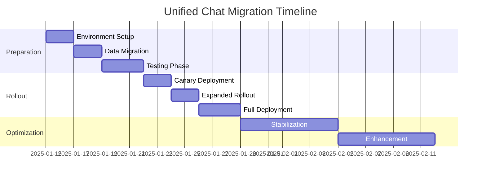

# Unified Chat System Migration Plan

## Overview

This document outlines the step-by-step migration plan from the traditional Chat interface to the new Unified Chat Management System, ensuring zero downtime and seamless user experience.

## Migration Strategy

### Phase 1: Pre-Migration Setup (Week 1)

#### Day 1-2: Environment Preparation
- [ ] Deploy unified chat component to staging environment
- [ ] Configure AI service connections and API endpoints
- [ ] Set up monitoring and logging systems
- [ ] Prepare rollback procedures

#### Day 3-4: Data Migration
- [ ] Backup existing chat conversations and user data
- [ ] Migrate message history to new schema with AI metadata placeholders
- [ ] Verify data integrity and completeness
- [ ] Test data migration rollback procedures

#### Day 5-7: Testing Phase
- [ ] Execute comprehensive test suite
- [ ] Perform load testing with simulated traffic
- [ ] Validate AI integration functionality
- [ ] User acceptance testing with key stakeholders

### Phase 2: Gradual Rollout (Week 2)

#### Day 1-2: Canary Deployment
- [ ] Deploy to 5% of users (admin users only)
- [ ] Monitor system performance and error rates
- [ ] Collect initial user feedback
- [ ] Address any critical issues

#### Day 3-4: Expanded Rollout
- [ ] Increase to 25% of users (include department heads)
- [ ] Monitor AI accuracy metrics
- [ ] Fine-tune AI confidence thresholds
- [ ] Provide user training sessions

#### Day 5-7: Full Deployment
- [ ] Roll out to 100% of users
- [ ] Continue performance monitoring
- [ ] Provide ongoing support
- [ ] Document lessons learned

### Phase 3: Post-Migration Optimization (Week 3-4)

#### Week 3: Stabilization
- [ ] Monitor system stability and performance
- [ ] Optimize AI processing based on real usage patterns
- [ ] Address user feedback and feature requests
- [ ] Fine-tune UI/UX based on user behavior

#### Week 4: Enhancement
- [ ] Deploy additional AI features based on user needs
- [ ] Implement advanced filtering and search capabilities
- [ ] Optimize mobile responsiveness
- [ ] Plan future feature releases

## Testing Checklist

### Functional Testing

#### Core Chat Features
- [ ] User can send and receive messages
- [ ] Message history loads correctly
- [ ] User presence status updates in real-time
- [ ] File attachments work properly
- [ ] Voice/video call integration functions
- [ ] Search functionality operates correctly
- [ ] Message actions (reply, forward, delete) work

#### AI Features
- [ ] AI mode toggle switches correctly
- [ ] Messages are categorized accurately
- [ ] Priority levels are assigned appropriately
- [ ] Confidence scores are calculated correctly
- [ ] Suggested actions appear for relevant messages
- [ ] Visual flags and indicators display properly
- [ ] Metrics dashboard shows accurate data
- [ ] Filtering works with AI categories

#### Integration Testing
- [ ] AI service integration functions properly
- [ ] Real-time message delivery works
- [ ] User authentication and authorization
- [ ] API endpoints respond correctly
- [ ] Database operations complete successfully
- [ ] Error handling works as expected

### Performance Testing

#### Load Testing Scenarios
```bash
# Test concurrent users
artillery run load-test-configs/concurrent-users.yml

# Test message throughput
artillery run load-test-configs/message-volume.yml

# Test AI processing under load
artillery run load-test-configs/ai-processing.yml
```

#### Performance Benchmarks
- **Message Send Latency**: < 100ms
- **AI Processing Time**: < 500ms
- **Page Load Time**: < 2 seconds
- **Memory Usage**: < 100MB per 1000 messages
- **Concurrent Users**: Support 1000+ simultaneous users

### Security Testing

#### Authentication & Authorization
- [ ] User authentication works correctly
- [ ] Role-based access control functions
- [ ] Session management is secure
- [ ] API authentication is validated
- [ ] Cross-site scripting prevention
- [ ] SQL injection protection

#### Data Protection
- [ ] Message encryption in transit
- [ ] Sensitive data masking
- [ ] Audit logging functions
- [ ] Data retention policies enforced
- [ ] HIPAA compliance maintained
- [ ] User privacy settings respected

### Compatibility Testing

#### Browser Support
- [ ] Chrome (latest 2 versions)
- [ ] Firefox (latest 2 versions)
- [ ] Safari (latest 2 versions)
- [ ] Edge (latest 2 versions)
- [ ] Mobile browsers (iOS Safari, Chrome Mobile)

#### Device Testing
- [ ] Desktop (1920x1080, 1366x768)
- [ ] Tablet (768x1024, 1024x768)
- [ ] Mobile (375x667, 414x896)
- [ ] High-DPI displays
- [ ] Touch interface functionality

## Risk Assessment and Mitigation

### High-Risk Areas

#### AI Service Dependency
**Risk**: AI service failure could impact core functionality
**Mitigation**: 
- Implement fallback to traditional mode
- Set up AI service health monitoring
- Create AI service redundancy
- Cache AI results for offline use

#### Data Migration
**Risk**: Data loss or corruption during migration
**Mitigation**:
- Complete data backup before migration
- Implement rollback procedures
- Validate data integrity at each step
- Test migration on staging environment

#### User Adoption
**Risk**: Users may resist new AI features
**Mitigation**:
- Provide comprehensive training
- Make AI features optional initially
- Gather user feedback continuously
- Implement gradual feature introduction

### Medium-Risk Areas

#### Performance Degradation
**Risk**: New features may slow down the system
**Mitigation**:
- Implement performance monitoring
- Optimize code and database queries
- Use caching strategies
- Load test before deployment

#### Integration Issues
**Risk**: Problems with existing systems
**Mitigation**:
- Thorough integration testing
- Maintain API compatibility
- Implement graceful degradation
- Prepare rollback procedures

## Rollback Procedures

### Emergency Rollback (< 5 minutes)
```bash
# Quick rollback to previous version
kubectl rollout undo deployment/unified-chat
kubectl rollout status deployment/unified-chat

# Verify rollback success
kubectl get pods -l app=unified-chat
curl -f http://localhost:8080/health
```

### Planned Rollback (< 30 minutes)
1. **Notify Users**: Send advance notification about rollback
2. **Stop New Deployments**: Halt any ongoing deployment processes
3. **Database Rollback**: Restore previous database schema if needed
4. **Code Rollback**: Deploy previous version of the application
5. **Verify Functionality**: Test core features work correctly
6. **Monitor System**: Watch for any issues post-rollback

### Data Recovery Procedures
```sql
-- Restore messages table from backup
DROP TABLE IF EXISTS messages_backup;
CREATE TABLE messages_backup AS SELECT * FROM messages;

-- Restore from previous backup
INSERT INTO messages SELECT * FROM messages_backup_20250101;

-- Verify data integrity
SELECT COUNT(*) FROM messages;
SELECT MAX(created_at) FROM messages;
```

## Monitoring and Alerting

### Key Metrics to Monitor

#### System Health
- Application uptime and availability
- Response time and latency
- Error rates and exceptions
- Memory and CPU usage
- Database performance metrics

#### Business Metrics
- Message send/receive rates
- User engagement metrics
- AI accuracy scores
- Feature adoption rates
- User satisfaction scores

### Alert Thresholds

#### Critical Alerts (Immediate Response)
- Application downtime > 1 minute
- Error rate > 5%
- AI service unavailable
- Database connection failures
- Security breaches

#### Warning Alerts (Response within 1 hour)
- Response time > 2 seconds
- Memory usage > 80%
- AI accuracy < 85%
- High user complaint volume
- Feature usage anomalies

### Monitoring Tools Configuration

```yaml
# Prometheus monitoring rules
groups:
- name: unified-chat-alerts
  rules:
  - alert: HighErrorRate
    expr: rate(http_requests_total{status=~"5.."}[5m]) > 0.05
    for: 5m
    labels:
      severity: critical
    annotations:
      summary: High error rate detected

  - alert: AIServiceDown
    expr: up{job="ai-service"} == 0
    for: 2m
    labels:
      severity: critical
    annotations:
      summary: AI service is down

  - alert: SlowResponseTime
    expr: histogram_quantile(0.95, rate(http_request_duration_seconds_bucket[5m])) > 2
    for: 10m
    labels:
      severity: warning
    annotations:
      summary: Slow response times detected
```

## User Training Plan

### Training Materials

#### Quick Start Guide
- [ ] "Getting Started with Unified Chat" (5-minute video)
- [ ] "Understanding AI Mode" (interactive tutorial)
- [ ] "Using AI Suggestions" (step-by-step guide)
- [ ] "Customizing Your Experience" (settings overview)

#### Advanced Training
- [ ] "Maximizing AI Features" (30-minute webinar)
- [ ] "Troubleshooting Common Issues" (FAQ document)
- [ ] "Best Practices for Healthcare Communication" (guidelines)
- [ ] "Privacy and Security Features" (compliance training)

### Training Schedule

#### Week 1: Management and IT Staff
- Overview of new system capabilities
- Technical implementation details
- Support procedures and escalation
- Change management strategies

#### Week 2: Department Heads and Supervisors
- Feature demonstrations and benefits
- User adoption strategies
- Feedback collection methods
- Performance monitoring insights

#### Week 3: All Staff Training
- Hands-on training sessions
- Q&A and support sessions
- Feedback collection
- Individual assistance as needed

### Training Delivery Methods

#### Online Training
- Interactive tutorials within the application
- Video training library
- Self-paced learning modules
- Virtual training sessions

#### In-Person Training
- Department-specific training sessions
- One-on-one support for key users
- Group demonstrations
- Lunch-and-learn sessions

## Success Metrics

### Technical Success Criteria

#### Performance Metrics
- System uptime: > 99.9%
- Response time: < 1 second average
- AI processing: < 500ms average
- Error rate: < 0.1%
- Load capacity: 1000+ concurrent users

#### Functional Metrics
- Feature adoption: > 80% of users try AI mode
- AI accuracy: > 90% correct categorization
- User retention: > 95% continue using system
- Support tickets: < 10 per week after training
- Data integrity: 100% message preservation

### Business Success Criteria

#### User Experience
- User satisfaction: > 4.5/5 rating
- Task completion time: 20% improvement
- Training completion: > 95% of staff
- Feature utilization: > 70% use AI features
- Feedback quality: > 80% positive responses

#### Operational Impact
- Communication efficiency: 25% improvement
- Response time to critical messages: 50% faster
- Administrative overhead: 30% reduction
- Error prevention: 40% fewer communication mistakes
- Cost savings: 15% reduction in communication costs

## Post-Migration Support

### Support Team Structure

#### Tier 1 Support (General Issues)
- Basic troubleshooting
- User training assistance
- Feature usage guidance
- Initial problem assessment

#### Tier 2 Support (Technical Issues)
- Advanced troubleshooting
- System configuration issues
- Integration problems
- Performance optimization

#### Tier 3 Support (Complex Issues)
- System architecture problems
- AI model adjustments
- Database optimization
- Security issues

### Support Procedures

#### Incident Response
1. **Issue Identification**: User reports or system alerts
2. **Initial Assessment**: Categorize severity and impact
3. **Immediate Response**: Provide temporary workarounds
4. **Investigation**: Analyze root cause
5. **Resolution**: Implement permanent fix
6. **Verification**: Confirm issue is resolved
7. **Documentation**: Update knowledge base

#### Communication Plan
- Real-time status updates via system dashboard
- Regular email updates to stakeholders
- Scheduled maintenance notifications
- Performance reports and metrics sharing

## Timeline Summary



## Conclusion

This migration plan ensures a smooth transition from the traditional chat system to the new Unified Chat Management System. By following this structured approach with proper testing, monitoring, and support procedures, we can achieve zero downtime migration while delivering enhanced functionality to our users.

The success of this migration depends on careful execution of each phase, continuous monitoring of system performance, and responsive support for our users throughout the transition period.

---

*Migration Plan prepared by: Development Team*  
*Plan reviewed by: Project Management, QA Team, IT Operations*  
*Last updated: January 2025*
