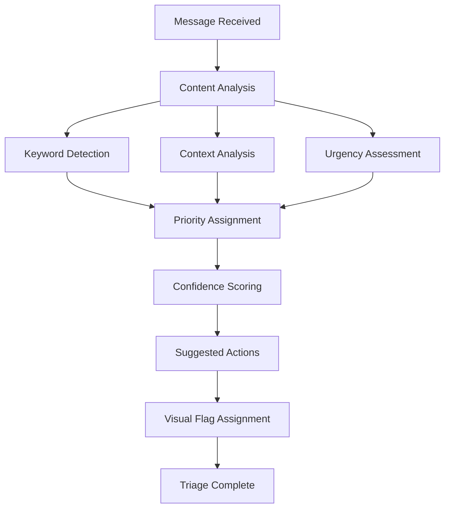
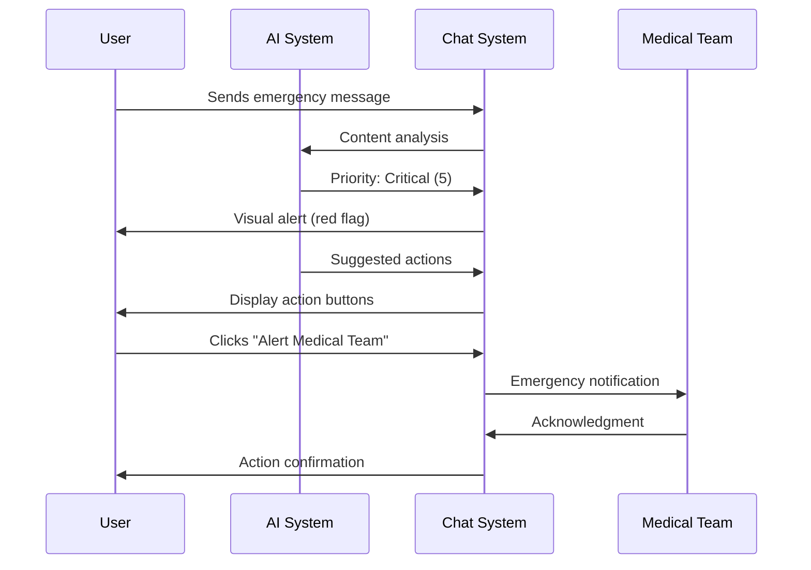

# Unified Chat Management System Documentation

## Overview

The Unified Chat Management System seamlessly integrates traditional chat functionality with AI-powered inbox triage features, providing healthcare professionals with an intelligent messaging platform that prioritizes communications and suggests automated actions.

## Table of Contents

1. [System Architecture](#system-architecture)
2. [Key Features](#key-features)
3. [Component Structure](#component-structure)
4. [AI Integration](#ai-integration)
5. [User Interface](#user-interface)
6. [Workflows](#workflows)
7. [API Integration](#api-integration)
8. [Configuration](#configuration)
9. [Testing](#testing)
10. [Troubleshooting](#troubleshooting)

## System Architecture

### Core Components

```
UnifiedChat (Main Component)
├── Traditional Chat Interface
│   ├── User List Sidebar
│   ├── Message Thread View
│   └── Message Input System
├── AI Triage System
│   ├── Priority Categorization
│   ├── Suggested Actions
│   ├── Visual Flags
│   └── Metrics Dashboard
└── Unified Controls
    ├── Mode Toggle (AI/Traditional)
    ├── Smart Filtering
    └── Advanced Search
```

### Dependencies

- **React**: Core framework for component rendering
- **TypeScript**: Type safety and enhanced development experience
- **Ant Design**: UI components for advanced features
- **OverlayScrollbars**: Custom scrolling for chat areas
- **React Router**: Navigation and routing
- **AI Notification Service**: Backend AI processing

## Key Features

### Traditional Chat Features

- **Real-time Messaging**: Instant message delivery and receipt
- **User Presence**: Online/offline status indicators
- **Message History**: Persistent conversation storage
- **File Attachments**: Support for images, documents, and media
- **Voice/Video Calls**: Integrated communication options
- **Message Actions**: Reply, forward, delete, and archive
- **Search Functionality**: Find conversations and messages
- **Responsive Design**: Works across desktop, tablet, and mobile

### AI-Enhanced Features

- **Intelligent Prioritization**: Automatic categorization of messages by urgency
- **Smart Triage**: AI-powered sorting based on content analysis
- **Suggested Actions**: Contextual recommendations for message responses
- **Visual Indicators**: Color-coded priority flags and badges
- **Confidence Scoring**: AI accuracy indicators for each categorization
- **Automated Filtering**: Smart filtering based on AI analysis
- **Metrics Dashboard**: Real-time analytics on chat performance
- **Risk Assessment**: Identification of critical situations

## Component Structure

### Main Component: UnifiedChat

```typescript
interface UnifiedChatProps {
  // No props required - self-contained system
}

interface ChatMessage {
  id: string;
  senderId: string;
  senderName: string;
  senderAvatar: string;
  message: string;
  timestamp: Date;
  isOwn: boolean;
  type: 'text' | 'image' | 'file' | 'system';
  aiEnhanced?: AIEnhancedData;
}

interface AIEnhancedData {
  priority: number;           // 1-5 priority scale
  category: 'critical' | 'important' | 'routine' | 'informational';
  confidence: number;         // 0-1 confidence score
  suggestedActions?: Action[];
  flags?: string[];
  metadata?: Record<string, any>;
}
```

### State Management

```typescript
// Core state
const [isAIMode, setIsAIMode] = useState(false);
const [selectedUser, setSelectedUser] = useState<ChatUser | null>(null);
const [messages, setMessages] = useState<ChatMessage[]>([]);
const [chatUsers, setChatUsers] = useState<ChatUser[]>([]);

// AI-specific state
const [triageMetrics, setTriageMetrics] = useState<TriageMetrics>();
const [filters, setFilters] = useState<FilterState>();
```

## AI Integration

### Priority Categories

1. **Critical** (Red - #dc3545)
   - Emergency situations
   - Life-threatening conditions
   - Immediate action required
   - Examples: Code blue, cardiac arrest, severe allergic reactions

2. **Important** (Orange - #fd7e14)
   - Urgent medical needs
   - Time-sensitive requests
   - High-priority administrative tasks
   - Examples: Surgery scheduling conflicts, lab critical values

3. **Routine** (Blue - #0dcaf0)
   - Standard medical communications
   - Regular administrative tasks
   - Scheduled procedures
   - Examples: Appointment confirmations, routine lab results

4. **Informational** (Gray - #6c757d)
   - System notifications
   - General announcements
   - Administrative updates
   - Examples: Policy updates, system maintenance notices

### AI Processing Workflow



### Confidence Scoring

- **95-100%**: High confidence - AI recommendations highly reliable
- **85-94%**: Good confidence - AI recommendations generally accurate
- **70-84%**: Moderate confidence - Human review recommended
- **Below 70%**: Low confidence - Manual review required

### Suggested Actions

The AI system provides contextual action suggestions based on message content:

- **Emergency Actions**: Alert medical team, prepare equipment, contact specialists
- **Administrative Actions**: Schedule appointments, update records, notify departments
- **Communication Actions**: Send acknowledgments, request clarification, escalate priority
- **System Actions**: Log incidents, create tasks, generate reports

## User Interface

### Mode Toggle

The system features a prominent toggle switch that allows users to seamlessly switch between traditional chat mode and AI-enhanced mode:

```typescript
<Switch
  checked={isAIMode}
  onChange={toggleAIMode}
  checkedChildren={<i className="ti ti-robot" />}
  unCheckedChildren={<i className="ti ti-message" />}
/>
```

### Visual Design

#### Traditional Mode
- Clean, minimal interface
- Focus on conversation flow
- Standard messaging features
- Familiar chat experience

#### AI Mode
- Enhanced visual indicators
- Priority badges and flags
- Metrics dashboard
- Action suggestion buttons
- Confidence indicators

### Responsive Design

The system adapts to different screen sizes:

- **Desktop (1200px+)**: Full feature set with sidebar and main chat area
- **Tablet (768-1199px)**: Optimized layout with collapsible sidebar
- **Mobile (<768px)**: Stacked interface with touch-optimized controls

## Workflows

### Standard Chat Workflow

1. **User Selection**: Choose conversation from user list
2. **Message Viewing**: Read conversation history
3. **Message Composition**: Type and send new messages
4. **Action Execution**: Perform standard chat actions (reply, forward, etc.)

### AI-Enhanced Workflow

1. **AI Analysis**: System automatically analyzes incoming messages
2. **Priority Assignment**: Messages categorized by urgency and importance
3. **Visual Indication**: Priority flags and badges applied
4. **Action Suggestion**: AI recommends appropriate responses
5. **User Decision**: User can accept, modify, or ignore AI suggestions
6. **Execution**: Actions performed with optional AI assistance

### Emergency Response Workflow



## API Integration

### Required Endpoints

#### Chat Management
- `GET /api/chat/conversations` - List user conversations
- `GET /api/chat/messages/:conversationId` - Get conversation messages
- `POST /api/chat/messages` - Send new message
- `PUT /api/chat/messages/:messageId` - Update message
- `DELETE /api/chat/messages/:messageId` - Delete message

#### AI Triage
- `POST /api/ai/analyze-message` - Analyze message content
- `GET /api/ai/metrics` - Get triage metrics
- `POST /api/ai/suggested-actions` - Get action suggestions
- `PUT /api/ai/override` - Override AI categorization

#### User Management
- `GET /api/users` - List available users
- `GET /api/users/:userId/presence` - Get user online status
- `POST /api/users/search` - Search users

### Data Models

```typescript
// API Response Models
interface APIResponse<T> {
  success: boolean;
  data: T;
  message?: string;
  error?: string;
}

interface ConversationResponse {
  id: string;
  participants: User[];
  lastMessage: Message;
  unreadCount: number;
  aiMetadata?: {
    priority: number;
    category: string;
    lastAnalyzed: Date;
  };
}

interface MessageResponse {
  id: string;
  content: string;
  senderId: string;
  timestamp: Date;
  type: string;
  aiAnalysis?: {
    priority: number;
    category: string;
    confidence: number;
    suggestedActions: Action[];
    flags: string[];
  };
}
```

## Configuration

### Environment Variables

```bash
# AI Service Configuration
REACT_APP_AI_SERVICE_URL=https://api.ai-service.com
REACT_APP_AI_CONFIDENCE_THRESHOLD=0.7
REACT_APP_AI_ENABLE_SUGGESTIONS=true

# Chat Service Configuration
REACT_APP_CHAT_SERVICE_URL=https://api.chat-service.com
REACT_APP_REALTIME_ENABLED=true
REACT_APP_FILE_UPLOAD_MAX_SIZE=10485760

# Feature Flags
REACT_APP_ENABLE_AI_MODE=true
REACT_APP_ENABLE_VOICE_CALLS=true
REACT_APP_ENABLE_VIDEO_CALLS=true
```

### AI Configuration

```typescript
const aiConfig = {
  priorityThresholds: {
    critical: 0.9,
    important: 0.7,
    routine: 0.5,
    informational: 0.3
  },
  keywordCategories: {
    emergency: ['emergency', 'urgent', 'stat', 'code blue', 'cardiac arrest'],
    medical: ['patient', 'surgery', 'medication', 'lab results', 'vitals'],
    administrative: ['schedule', 'appointment', 'billing', 'insurance']
  },
  confidenceSettings: {
    minimumConfidence: 0.6,
    highConfidenceThreshold: 0.9,
    enableLowConfidenceWarnings: true
  }
};
```

## Testing

### Unit Tests

```typescript
// Test files location: __tests__/
describe('UnifiedChat Component', () => {
  test('renders traditional chat mode by default', () => {
    render(<UnifiedChat />);
    expect(screen.getByText('Chat')).toBeInTheDocument();
  });

  test('toggles to AI mode correctly', () => {
    render(<UnifiedChat />);
    const toggle = screen.getByRole('switch');
    fireEvent.click(toggle);
    expect(screen.getByText('AI-Enhanced Chat')).toBeInTheDocument();
  });

  test('displays AI metrics in AI mode', () => {
    render(<UnifiedChat />);
    const toggle = screen.getByRole('switch');
    fireEvent.click(toggle);
    expect(screen.getByText('Active Chats')).toBeInTheDocument();
  });
});
```

### Integration Tests

```typescript
describe('AI Integration', () => {
  test('processes messages with AI analysis', async () => {
    const mockMessage = {
      content: 'Emergency in room 302',
      senderId: 'user-1'
    };
    
    const result = await aiNotificationService.processNotifications([mockMessage]);
    expect(result[0].aiCategory).toBe('critical');
    expect(result[0].aiPriority).toBe(5);
  });
});
```

### End-to-End Tests

```typescript
// E2E tests using Cypress or Playwright
describe('Chat Workflow', () => {
  test('complete chat conversation with AI features', () => {
    cy.visit('/application/chat');
    cy.get('[data-testid="ai-toggle"]').click();
    cy.get('[data-testid="user-list"]').contains('Mark Smith').click();
    cy.get('[data-testid="message-input"]').type('Patient needs immediate attention');
    cy.get('[data-testid="send-button"]').click();
    cy.get('[data-testid="ai-suggestions"]').should('be.visible');
  });
});
```

### Performance Tests

- **Load Testing**: 1000+ concurrent users
- **Message Throughput**: 10,000 messages per minute
- **AI Processing Time**: <500ms per message
- **Memory Usage**: <100MB per 1000 messages

## Troubleshooting

### Common Issues

#### AI Mode Not Working

**Symptoms**: AI toggle doesn't activate AI features
**Causes**: 
- AI service unavailable
- Configuration errors
- Network connectivity issues

**Solutions**:
1. Check AI service status
2. Verify environment variables
3. Check browser console for errors
4. Ensure proper API authentication

#### Poor AI Accuracy

**Symptoms**: Incorrect message categorization
**Causes**:
- Insufficient training data
- Outdated AI models
- Domain-specific terminology

**Solutions**:
1. Review and update AI training data
2. Adjust confidence thresholds
3. Implement manual override system
4. Add domain-specific keywords

#### Performance Issues

**Symptoms**: Slow message loading, laggy interface
**Causes**:
- Large message history
- Inefficient rendering
- Memory leaks

**Solutions**:
1. Implement message pagination
2. Use React.memo for optimization
3. Clean up event listeners
4. Optimize image loading

### Error Codes

- **AI_001**: AI service connection failed
- **AI_002**: Confidence threshold too low
- **AI_003**: Invalid AI response format
- **CHAT_001**: Message send failed
- **CHAT_002**: User not found
- **CHAT_003**: Conversation load error

### Logging

```typescript
// Enable debug logging
localStorage.setItem('chat-debug', 'true');

// AI processing logs
console.log('[AI] Processing message:', messageId);
console.log('[AI] Category assigned:', category);
console.log('[AI] Confidence score:', confidence);

// Performance monitoring
console.time('message-render');
// ... rendering code
console.timeEnd('message-render');
```

## Migration Guide

### From Traditional Chat

1. **Backup Data**: Export existing conversations
2. **Update Dependencies**: Install new packages
3. **Replace Component**: Update routing to use UnifiedChat
4. **Test Functionality**: Verify all features work
5. **Train Users**: Provide AI feature training

### Database Schema Updates

```sql
-- Add AI metadata to messages table
ALTER TABLE messages ADD COLUMN ai_priority INTEGER;
ALTER TABLE messages ADD COLUMN ai_category VARCHAR(50);
ALTER TABLE messages ADD COLUMN ai_confidence DECIMAL(3,2);
ALTER TABLE messages ADD COLUMN ai_flags JSON;
ALTER TABLE messages ADD COLUMN ai_metadata JSON;

-- Create AI analytics table
CREATE TABLE ai_analytics (
  id SERIAL PRIMARY KEY,
  message_id UUID REFERENCES messages(id),
  analysis_timestamp TIMESTAMP DEFAULT NOW(),
  processing_time_ms INTEGER,
  confidence_score DECIMAL(3,2),
  suggested_actions JSON
);
```

## Future Enhancements

### Planned Features

1. **Voice-to-Text AI**: Automatic transcription with AI analysis
2. **Predictive Typing**: AI-powered message completion
3. **Smart Scheduling**: Intelligent appointment booking
4. **Multilingual Support**: Real-time translation with AI
5. **Advanced Analytics**: Detailed communication insights
6. **Custom AI Training**: Department-specific AI models

### Roadmap

- **Q1 2025**: Enhanced voice integration
- **Q2 2025**: Advanced analytics dashboard
- **Q3 2025**: Multilingual support
- **Q4 2025**: Custom AI training tools

## Support and Maintenance

### Regular Maintenance

- **Daily**: Monitor AI accuracy metrics
- **Weekly**: Review system performance
- **Monthly**: Update AI training data
- **Quarterly**: Security and dependency updates

### Support Contacts

- **Technical Issues**: [tech-support@symplify.com](mailto:tech-support@symplify.com)
- **AI/ML Issues**: [ai-support@symplify.com](mailto:ai-support@symplify.com)
- **User Training**: [training@symplify.com](mailto:training@symplify.com)

---

*This documentation is maintained by the Development Team. Last updated: January 2025*
