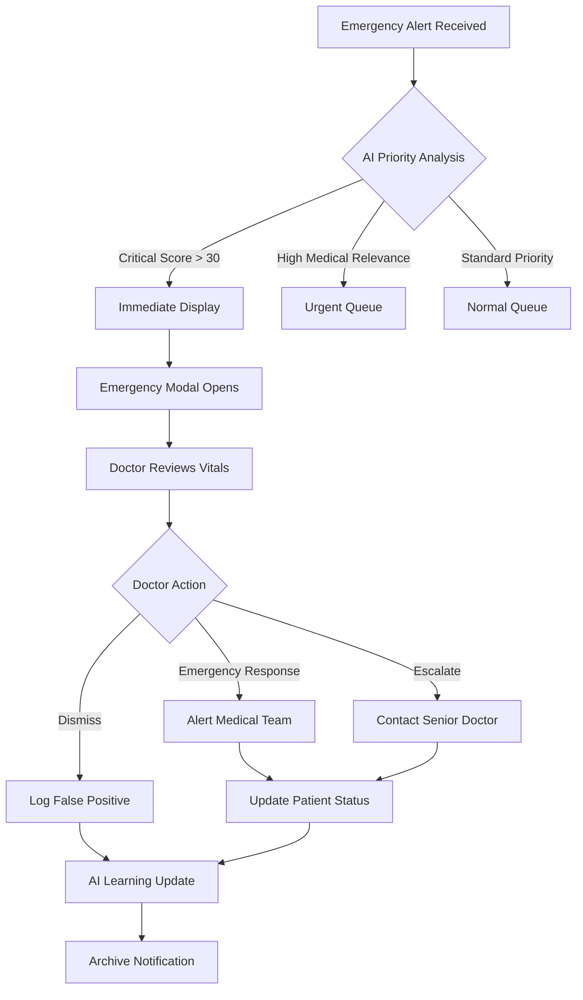
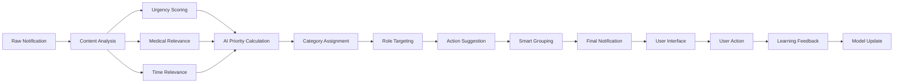
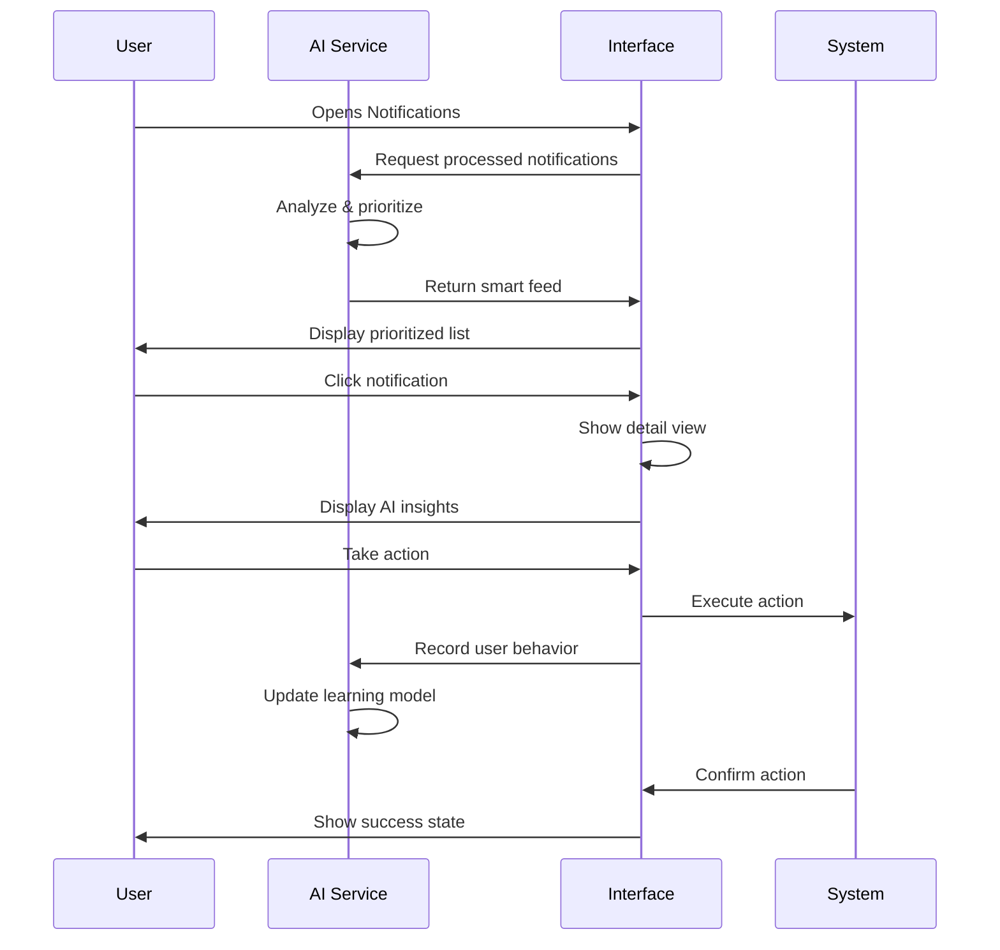

# AI-Powered Notifications Feed - User Workflow Documentation

## Overview

This document outlines the complete user workflows and integration points for the AI-Powered Notifications Feed feature in the healthcare management system.

## User Personas and Workflows

### 1. Emergency Doctor Workflow

#### Critical Alert Scenario
```
1. Emergency Notification Arrives
   ├── AI automatically categorizes as "critical" 
   ├── Priority score: 5/5
   ├── Visual: Red pulsing border + emergency sound
   └── Auto-display: Emergency detail modal

2. Doctor Reviews Alert
   ├── Patient vitals displayed prominently
   ├── AI insight: "Critical: Requires intervention within 10 minutes"
   ├── Suggested actions: [Emergency Response] [Alert Team]
   └── Response timer: Shows elapsed time

3. Doctor Takes Action
   ├── Clicks "Emergency Response"
   ├── System logs action + response time
   ├── Auto-notifies medical team
   └── Updates patient status

4. Follow-up Processing
   ├── AI learns from response time
   ├── Adjusts future emergency priorities
   └── Archives notification with outcomes
```

#### Medical Review Workflow
```
1. Lab Results Notification
   ├── AI categorizes as "medical" (urgent)
   ├── Priority score: 4/5
   ├── AI insight: "Medical attention needed: Contact patient within 2 hours"
   └── Suggested action: [Contact Patient] [Schedule Follow-up]

2. Doctor Reviews Results
   ├── Opens detailed view with lab values
   ├── Views normal ranges vs. actual results
   ├── Reads AI-generated medical summary
   └── Reviews recommended actions

3. Doctor Makes Decision
   ├── Selects "Contact Patient Now"
   ├── System pre-fills patient contact info
   ├── Logs consultation scheduling
   └── Updates medical records

4. Continuous Learning
   ├── AI tracks doctor's preferred actions
   ├── Learns response patterns by time of day
   └── Improves future medical prioritization
```

### 2. Nurse Workflow

#### Shift Handover Scenario
```
1. Nurse Logs In
   ├── AI displays role-filtered notifications
   ├── Groups routine notifications by similarity
   ├── Highlights urgent medical updates
   └── Shows overnight patient changes

2. Priority Review
   ├── Critical alerts shown first (red)
   ├── Urgent items grouped by department
   ├── Routine items collapsed in smart groups
   └── AI insight: "3 high-priority items need attention"

3. Task Processing
   ├── Marks routine items as acknowledged
   ├── Forwards complex issues to doctors
   ├── Updates patient care notes
   └── Sets reminders for follow-ups

4. Shift End Summary
   ├── AI generates summary of actions taken
   ├── Highlights unresolved items
   └── Provides handover notes for next shift
```

### 3. Administrator Workflow

#### Department Management
```
1. Daily Admin Review
   ├── Receives administrative notifications
   ├── AI groups similar policy updates
   ├── Prioritizes by organizational impact
   └── Shows compliance deadlines

2. Bulk Processing
   ├── Uses AI smart grouping feature
   ├── Approves multiple similar requests
   ├── Delegates appropriate notifications
   └── Archives completed items

3. Settings Management
   ├── Configures department-wide AI settings
   ├── Sets role-based filtering rules
   ├── Manages notification delivery methods
   └── Reviews AI performance analytics
```

## Detailed Workflow Diagrams

### Emergency Response Flow


### AI Processing Pipeline


### User Interaction Flow


## Integration Points

### 1. Header Notification Dropdown Integration

```typescript
// File: src/core/common/header/header.tsx
import AINotificationsFeed from '../../../feature-module/components/pages/application-modules/application/notifications/ai-notifications-feed';
import useAINotifications from '../../../core/hooks/useAINotifications';

const Header = () => {
  const {
    notifications,
    unreadCount,
    getHighPriorityNotifications,
    markAsRead
  } = useAINotifications({
    settings: {
      roleBasedFiltering: {
        enabled: true,
        userRoles: ['doctor'], // Dynamic based on user
        departmentFilter: ['emergency', 'cardiology']
      }
    }
  });

  const criticalNotifications = getHighPriorityNotifications();

  return (
    <div className="notification-dropdown">
      <Badge count={unreadCount} dot>
        <BellIcon />
      </Badge>
      
      {/* Quick preview of critical items */}
      <div className="dropdown-content">
        {criticalNotifications.slice(0, 3).map(notification => (
          <NotificationQuickView 
            key={notification.id}
            notification={notification}
            onRead={() => markAsRead(notification.id)}
          />
        ))}
      </div>
    </div>
  );
};
```

### 2. Full Page Integration

```typescript
// File: src/feature-module/components/pages/application-modules/application/notifications/enhanced-notifications.tsx
import React, { useState } from 'react';
import AINotificationsFeed from './ai-notifications-feed';
import NotificationDetailView from './notification-detail-view';
import AINotificationSettings from './ai-notification-settings';
import useAINotifications from '../../../../../core/hooks/useAINotifications';

const EnhancedNotifications = () => {
  const [selectedNotification, setSelectedNotification] = useState(null);
  const [showSettings, setShowSettings] = useState(false);
  
  const {
    notifications,
    isLoading,
    error,
    settings,
    markAsRead,
    dismissNotification,
    updateSettings,
    recordUserAction
  } = useAINotifications({
    autoRefresh: true,
    refreshInterval: 30000,
    enableRealtime: true
  });

  const handleNotificationAction = (action: string) => {
    if (selectedNotification) {
      recordUserAction(selectedNotification.id, action);
      
      switch (action) {
        case 'mark-read':
          markAsRead(selectedNotification.id);
          break;
        case 'dismiss':
          dismissNotification(selectedNotification.id);
          break;
        // Handle other actions...
      }
    }
  };

  if (showSettings) {
    return (
      <AINotificationSettings
        settings={settings}
        onUpdateSettings={updateSettings}
        onClose={() => setShowSettings(false)}
      />
    );
  }

  return (
    <div className="enhanced-notifications-page">
      <div className="page-header">
        <h1>Smart Notifications</h1>
        <Button onClick={() => setShowSettings(true)}>
          AI Settings
        </Button>
      </div>

      <AINotificationsFeed
        notifications={notifications}
        isLoading={isLoading}
        error={error}
        onNotificationClick={setSelectedNotification}
        onNotificationAction={recordUserAction}
      />

      {selectedNotification && (
        <NotificationDetailView
          notification={selectedNotification}
          isVisible={!!selectedNotification}
          onClose={() => setSelectedNotification(null)}
          onAction={handleNotificationAction}
        />
      )}
    </div>
  );
};

export default EnhancedNotifications;
```

### 3. Router Integration

```typescript
// File: src/feature-module/routes/router.tsx
import EnhancedNotifications from '../components/pages/application-modules/application/notifications/enhanced-notifications';

// Add to routes configuration
{
  path: "/notifications/ai",
  element: <EnhancedNotifications />
},
{
  path: "/notifications/settings",
  element: <AINotificationSettings />
}
```

### 4. Sidebar Menu Integration

```typescript
// File: src/core/common/sidebar/sidebarData.tsx
{
  label: "Smart Notifications",
  key: "smart-notifications",
  icon: <i className="ti ti-bell-ringing" />,
  path: "/notifications/ai",
  badge: {
    count: unreadCount,
    color: "danger"
  },
  subItems: [
    {
      label: "All Notifications",
      key: "all-notifications",
      path: "/notifications/ai"
    },
    {
      label: "AI Settings",
      key: "ai-settings", 
      path: "/notifications/settings"
    }
  ]
}
```

## Implementation Guidelines

### 1. Initial Setup

```bash
# Install required dependencies
npm install antd react-router-dom

# Import styles in main.scss
@forward "pages/ai-notifications";
@forward "pages/notification-details";
@forward "pages/ai-notification-settings";
```

### 2. Environment Configuration

```typescript
// File: src/environment.tsx
export const AI_CONFIG = {
  ENABLED: true,
  REFRESH_INTERVAL: 30000,
  MAX_NOTIFICATIONS: 100,
  GROUPING_THRESHOLD: 70,
  LEARNING_MODE: true
};
```

### 3. User Role Configuration

```typescript
// File: src/core/services/user-service.ts
export const getUserAISettings = (user: User): Partial<AISettings> => {
  const roleBasedDefaults = {
    doctor: {
      categoryWeights: {
        emergency: 100,
        medical: 90,
        appointment: 70,
        administrative: 30,
        reminder: 20
      }
    },
    nurse: {
      categoryWeights: {
        emergency: 100,
        medical: 85,
        appointment: 60,
        administrative: 40,
        reminder: 50
      }
    },
    admin: {
      categoryWeights: {
        emergency: 80,
        medical: 50,
        appointment: 80,
        administrative: 90,
        reminder: 60
      }
    }
  };

  return roleBasedDefaults[user.role] || roleBasedDefaults.doctor;
};
```

## Performance Considerations

### 1. Optimization Strategies
- Use React.memo for notification items
- Implement virtual scrolling for large lists
- Debounce AI processing updates
- Cache processed notifications
- Lazy load notification details

### 2. Memory Management
```typescript
// Cleanup old notifications
const cleanupOldNotifications = useCallback(() => {
  const cutoffDate = new Date(Date.now() - 7 * 24 * 60 * 60 * 1000); // 7 days
  setNotifications(prev => 
    prev.filter(n => new Date(n.timestamp) > cutoffDate)
  );
}, []);
```

### 3. Error Handling
```typescript
const errorBoundaryWrapper = (
  <ErrorBoundary
    fallback={<NotificationErrorFallback />}
    onError={(error) => {
      console.error('AI Notifications Error:', error);
      // Log to error reporting service
    }}
  >
    <AINotificationsFeed />
  </ErrorBoundary>
);
```

## Accessibility Features

### 1. Screen Reader Support
- ARIA labels for all interactive elements
- Role attributes for notification priorities
- Live regions for dynamic content updates

### 2. Keyboard Navigation
- Tab order follows visual hierarchy
- Escape key closes modals and dropdowns
- Arrow keys navigate notification lists

### 3. High Contrast Mode
- Color-blind friendly priority indicators
- Alternative text for color-coded elements
- Sufficient contrast ratios

## Analytics and Monitoring

### 1. User Interaction Tracking
```typescript
const trackNotificationAction = (action: string, notification: ProcessedNotification) => {
  analytics.track('notification_action', {
    action,
    category: notification.category,
    priority: notification.aiPriority,
    responseTime: Date.now() - actionStartTime,
    userRole: currentUser.role
  });
};
```

### 2. AI Performance Metrics
- Classification accuracy rates
- User satisfaction scores
- Response time improvements
- False positive/negative rates

### 3. System Health Monitoring
- Processing latency
- Memory usage
- Error rates
- User engagement metrics

## Security Considerations

### 1. Data Privacy
- HIPAA compliance for patient data
- Encrypted notification content
- Access logging and audit trails

### 2. Role-Based Access Control
- Strict role validation
- Department-based filtering
- Administrative oversight capabilities

### 3. Content Sanitization
- XSS prevention in notification content
- Input validation for AI settings
- Secure API endpoints

## Testing Strategy

### 1. Unit Tests
```typescript
describe('AI Notification Service', () => {
  it('should correctly prioritize emergency notifications', () => {
    const notification = createMockEmergencyNotification();
    const processed = aiService.processNotification(notification);
    expect(processed.aiPriority).toBe(5);
    expect(processed.type).toBe('critical');
  });
});
```

### 2. Integration Tests
- End-to-end user workflows
- API integration testing
- Cross-browser compatibility
- Mobile responsiveness

### 3. Performance Tests
- Load testing with high notification volumes
- Memory leak detection
- AI processing speed benchmarks

This documentation provides a comprehensive guide for implementing and using the AI-Powered Notifications Feed feature, ensuring proper integration and optimal user experience across all healthcare roles.
